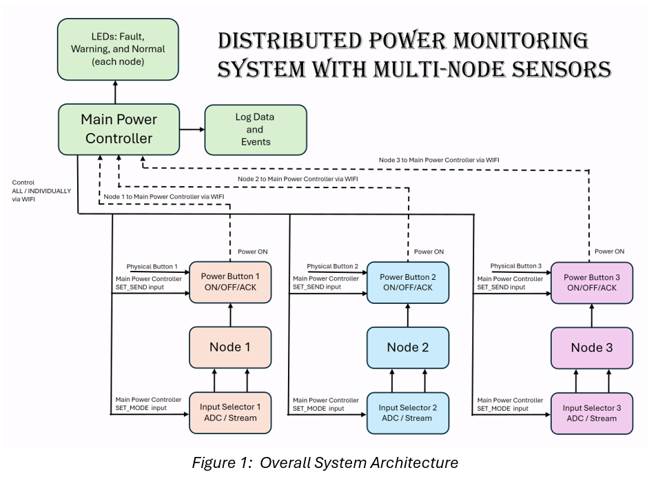

# Distributed Power Monitoring System  
**Multi-Node Embedded Architecture with ESP32 Sensors and Raspberry Pi Controller**

---

## Project Overview

This project implements a **distributed embedded power monitoring system** composed of **three ESP32-based sensor nodes** and a **Raspberry Pi supervisory controller**. The system continuously monitors voltage and current, detects abnormal operating conditions, and demonstrates **layered fault detection** with **local autonomy** and **centralized supervision**.

Each ESP32 node performs **local signal acquisition and RMS computation**, enabling fast, device-level response under fault conditions. The Raspberry Pi aggregates node measurements, performs system-level analysis, logs events, and provides real-time visual fault indication.

The architecture reflects real-world embedded power systems where **protection is decentralized**, but **visibility and control remain centralized**.

---

## System Architecture

### Overall System Diagram

### High-Level Structure
- **ESP32 Nodes (3x)**
  - Independent sensing subsystems
  - Local RMS computation
  - Autonomous overcurrent protection
  - Multiple input modes (ADC or streamed samples)
- **Raspberry Pi Controller**
  - Supervisory control and coordination
  - System-level fault classification
  - Multithreaded data processing and logging
  - LED-based fault visualization

### Design Philosophy
- Local autonomy for safety-critical decisions  
- Centralized supervision for observability and logging  
- Decoupled communication and processing paths  
- Deterministic multithreaded execution  

---

## ESP32 Node Firmware

### Key Features
- **Input Modes**
  - Physical ADC inputs (sensors / function generator)
  - Software-based waveform streaming (UDP)
- **Local RMS Computation**
  - 60-sample sliding window per measurement cycle
  - RMS voltage and current computed locally
- **Overcurrent Protection**
  - Trip threshold: **15 A RMS**
  - Evaluated across **3 consecutive cycles**
  - Latched fault state with transmission suppression
- **Recovery Logic**
  - Clear threshold: **12 A RMS**
  - Requires explicit acknowledgment from controller
- **Transmission Control**
  - UDP packets containing:
    - Node ID
    - Cycle counter
    - Vrms / Irms
  - Rate-limited to 1 packet per 100 ms
- **Physical & Remote Control**
  - Local enable/disable switch
  - Remote commands via Raspberry Pi

### Why RMS on the Node?
- Reduces communication bandwidth  
- Enables immediate local protection  
- Reflects real embedded protection devices  

---

## Raspberry Pi Controller

The Raspberry Pi runs **two cooperating processes** to separate concerns and ensure deterministic behavior.

---

### Process 1 – Network Controller

**Responsibilities**
- Receives measurement packets from ESP32 nodes
- Receives asynchronous fault notifications
- Issues control and acknowledgment commands
- Aggregates node data for processing

**Threads**
- UDP measurement receiver
- UDP fault receiver
- Interactive command interface

**Design Notes**
- Separate UDP ports for data, faults, and commands
- Non-blocking communication
- Forwards data to Process 2 via shared memory

---

### Process 2 – Data Processing & Logging

**Responsibilities**
- System-level analysis and classification
- Logging and visualization
- Diagnostic (non-protective) fault detection

**Threads**
- Voltage processing (sag / swell detection)
- Current processing (warning-level overcurrent)
- CSV logging and fault event logging
- LED control with priority-based blinking

**Fault Thresholds**

| Condition | Threshold | Action |
|---------|----------|--------|
| Voltage Sag | < 50 V RMS | Log + Indicate |
| Voltage Swell | > 130 V RMS | Log + Indicate |
| Overcurrent Warning | > 11 A RMS | Log + Indicate |
| Node Protection | > 15 A RMS | ESP32 isolation |

> Only ESP32 nodes perform protective isolation.  
> Raspberry Pi warnings are **diagnostic only**.

---

## Inter-Process Communication

- POSIX shared memory
- Semaphores for synchronization
- Mutex-protected shared structures
- Deterministic update intervals (~50 ms)

This separation ensures:
- Network jitter does not affect processing
- Logging does not block fault detection
- Scalable concurrency without race conditions

---

## Validation & Results

### Validation Methods
- Fault event log inspection
- Numerical RMS comparison against reference models
- Concurrency inspection (mutex-protected access)
- Visual LED confirmation
- Software-based fault injection

### Results Summary
- RMS error < **0.3%** across all nodes
- **100% pass rate** for:
  - Voltage classification
  - Current classification
  - Peak computation
  - Power calculation
- Verified intentional node isolation behavior
- No observed race conditions

**Key Observation:**  
When an ESP32 enters a faulted state, missing data is intentional, not a communication failure. Logs prior to isolation show rising current values, allowing fault reconstruction.

---

## Software-Based Waveform Streaming

To enable repeatable testing without physical power hardware:
- Raw ADC-equivalent samples are streamed to ESP32 nodes over UDP
- Identical signal-processing pipelines are used for ADC and streamed data
- Enables controlled fault injection and validation

---

## Learning Outcomes

This project demonstrates:
- Distributed embedded system design
- Local vs centralized signal processing tradeoffs
- Multithreaded real-time software architecture
- Fault detection and protection strategies
- IPC using shared memory and synchronization primitives
- Validation-driven embedded development

---

## License

This project is intended for **educational and academic use**.

---

## Author
Noridel Herron
BS in Computer Engineering
**Email**: github@noridel.com

